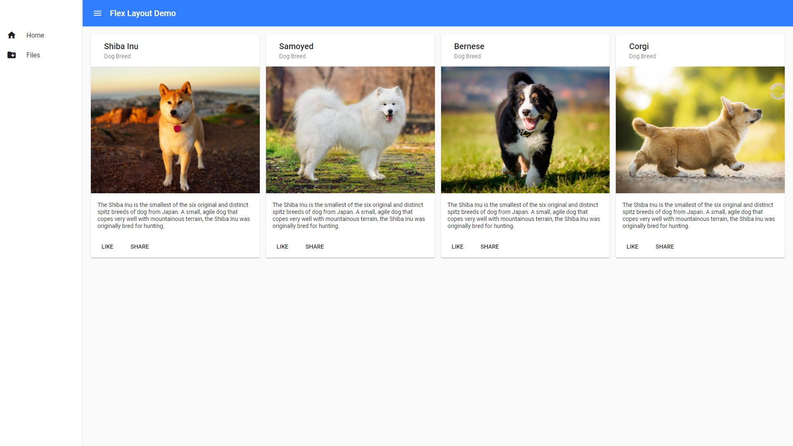
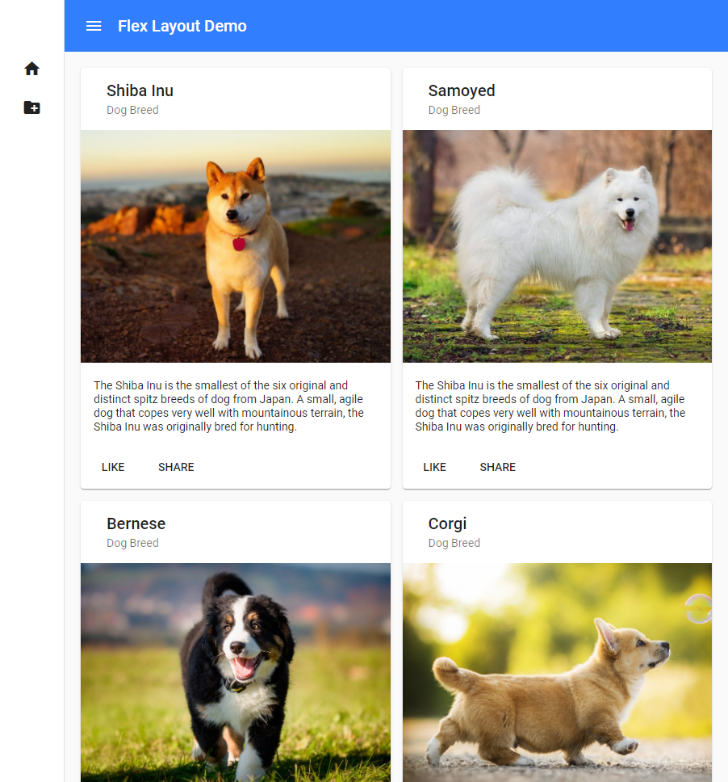
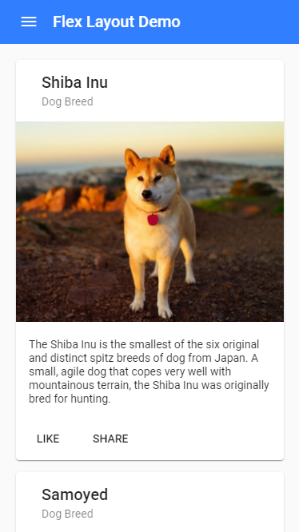

# [ng-flexlayout-demo](https://timc986.github.io/ng-flexlayout-demo)

A demo project for Angular Flex Layout with responsive UI design

Website: https://timc986.github.io/ng-flexlayout-demo

## Tech

* Built with **Angular version 11.0.5**
* Angular Flex Layout 11.0.0-beta.33 [link](https://github.com/angular/flex-layout )
* Angular Material 11.0.3, components: Button, Card, List, Icon, Sidenav, Toolbar [link](https://www.npmjs.com/package/@angular/material?activeTab=versions )

## Screenshots

